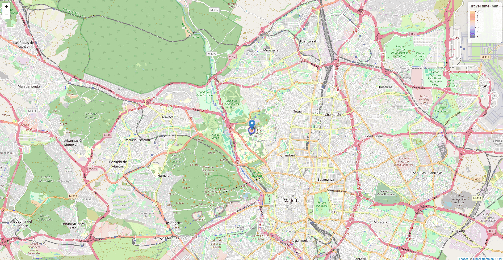

# Madrid Public Transport Accessibility Heatmap

[](https://posit.co/download/rstudio-desktop/)
[](https://rstudio.github.io/leaflet/)
[](https://github.com/pabloqb2000/R-Madrid-public-transport-accessibility/blob/master/LICENSE)

## Table of Contents
1. [Introduction](#introduction)
2. [Features](#features)
3. [Installation](#installation)
4. [Usage](#usage)
5. [Data Sources](#data-sources)
6. [Results](#results)
7. [Future Work](#future-work)
8. [License](#license)

## Introduction

This project leverages R and the leaflet library to analyze GTFS (General Transit Feed Specification) data from Madrid's public transport system. By inputting a starting position, time, available travel time, and average walking speed, the project generates an interactive heatmap of Madrid. This heatmap visualizes travel times to various locations accessible by walking and bus within the specified timeframe.

## Features

- **Grid Data Structure**: Utilizes a grid data structure for bus stops to optimize computational efficiency.
- **Actual Departure Time Consideration**: Incorporates actual bus departure times to enhance the accuracy of travel time calculations.
- **Interactive Heatmaps**: Generates dynamic, interactive heatmaps using the leaflet library, providing a visual representation of travel accessibility.
- **Comprehensive Coverage**: Includes both bus routes and metro lines, offering a holistic view of public transport accessibility.

## Installation

To set up the project on your local machine, follow these steps:

1. Clone the repository:
   ```sh
   git clone https://github.com/pabloqb2000/R-Madrid-public-transport-accessibility.git
   ```
2. Navigate to the project directory:
   ```sh
   cd R-Madrid-public-transport-accessibility
   ```
3. Install the required R packages by running:
   ```r
   install.packages(c("leaflet", "tidyverse", "dplyr", "lubridate", "raster", "beepr"))
   ```
4. Open the R Markdown file in RStudio or your preferred R environment.

## Usage

1. Open the R Markdown file (`madrid_transport_heatmap.Rmd`) in your R environment.
2. Customize the input parameters:
   - **Starting Position**: Specify your starting coordinates.
   - **Starting Time**: Set the departure time.
   - **Available Time**: Define the maximum travel time in minutes.
   - **Average Walking Speed**: Input your average walking speed in km/h.
3. Knit the R Markdown file to generate the heatmap.
4. The resulting heatmap will display travel times to all reachable locations within the specified timeframe.

## Data Sources

This project utilizes GTFS data from Madrid's public transport system, which includes detailed information about bus routes, schedules, and stops, as well as metro lines and frequencies.

## Results

Below is an example of the resulting heatmap for starting at 8:15am in Ciudad Universitaria and traveling for 5-10-15-...-60 minutes.



Checkout a comprehensive map of all Madrid bus routes, generated using GTFS data.


We also provide a detailed map of Madrid metro lines. The thickness of each metro line corresponds to its frequency at the specified hour and day.


## Future Work

- **Real-Time Data Integration**: Incorporate real-time public transport data to enhance accuracy.
- **Extended Coverage**: Expand the analysis to include additional modes of transport (e.g., trams, regional trains).
- **User Interface**: Develop a user-friendly interface for easier input parameter customization.

## License

This project is licensed under the MIT License. See the [LICENSE](./LICENSE) file for more details.
